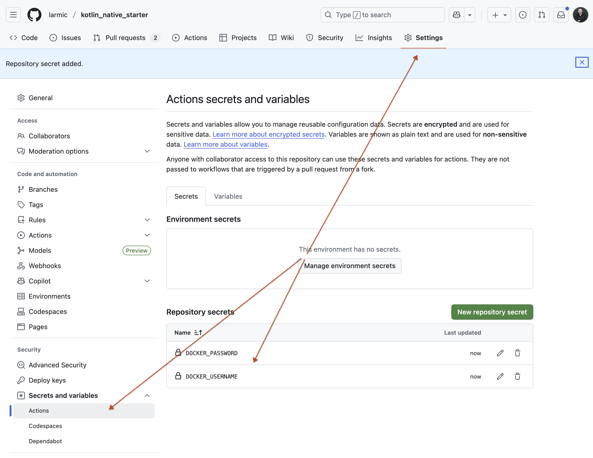

# kotlin_native-starter

## Overview
This serves as a straightforward example illustrating how [Kotlin/Native](https://kotlinlang.org/docs/native-overview.html), [Ktor](https://ktor.io/), [Docker](https://www.docker.com/), [Docker Hub](https://hub.docker.com/) and [GitHub Actions](https://github.com/features/actions) can work seamlessly together.
The ultimate goal is to achieve fully automated creation of a compact Docker image and its versioned
transfer to Docker Hub.

‼️Choosing the right runtime:
- [Kotlin/Native](https://kotlinlang.org/docs/native-overview.html), with static compilation and limited Java library support, shines for IoT, iOS/mobile, embedded targets, and small tools.
- For larger cloud-native apps, microservices, and serverless, prefer [GraalVM Native Image](https://www.graalvm.org/latest/reference-manual/native-image/).
- When startup time is less critical, the [JVM's JIT](https://www.ibm.com/docs/de/sdk-java-technology/8?topic=reference-jit-compiler) and runtime optimizations make it ideal for enterprise systems, monoliths, and other long-running services.

## Technologies used
* [Kotlin/Native](https://kotlinlang.org/docs/native-overview.html)
* [Ktor](https://ktor.io/) server framework
* [Gradle](https://gradle.org/) as build tool
* [Docker](https://www.docker.com/) as application container
* [Docker Hub](https://hub.docker.com/) as container registry
* [GitHub Actions](https://github.com/features/actions) to automate CI/CD workflows (build the Docker application, push to the registry,...)
* [Renovate](renovate.json) for automatic dependency updates

## Requirements
* [Local JDK 24 installation](https://openjdk.org/projects/jdk/24/) to build and run application without using docker for local debugging
* [Local Docker installation](https://docs.docker.com/engine/install/) to build docker container from local machine
* [Docker Hub account](https://hub.docker.com/signup) for automatic container upload to the registry
* [Installed Renovate GitHub App](https://github.com/apps/renovate) to support automatic dependency updates

## Restrictions
* No [Java 25](https://openjdk.org/projects/jdk/25/) support yet because [Kotlin Multiplatform](https://www.jetbrains.com/help/kotlin-multiplatform-dev/multiplatform-compatibility-guide.html) is not yet available for [Gradle 9.0](https://docs.gradle.org/current/userguide/compatibility.html), and lower Gradle versions do not support Java 25
* [Dockerfile](Dockerfile) is using --platform=linux/amd64 as build host, because build host aarch64 is not supported by [Kotlin/Native](https://youtrack.jetbrains.com/issue/KT-36871/Support-Aarch64-Linux-as-a-host-for-the-Kotlin-Native)
* Kotlin/Native does not include a JVM. Therefore, many Java libraries will not work. Only libraries that are explicitly Kotlin Multiplatform or those that can be integrated via C Interop are usable.

## Build on your current machine
- Debug: ./gradlew linkDebugExecutableApp
- Release: ./gradlew linkReleaseExecutableApp
- Artifacts: build/bin/app/(debugExecutable|releaseExecutable)/app.kexe (Unix) or app.exe (Windows)

## How to build this stuff?

See [Makefile](Makefile)!

## In-depth explanation

### How to use this example

1. Fork this project to your own [GitHub](https://github.com/) space
2. Add your personal [Docker Hub](https://hub.docker.com/) credentials to your repository

3. Change _IMAGE_NAME_ in [GitHub Actions](.github/workflows/docker-build-push.yml) to your specific name
4. Activate [Renovate](renovate.json) in your [GitHub](https://github.com/) repository to support automatically dependency updates. You may have to adapt the file [renovate.json](renovate.json) to your own needs

### Where are the unit tests?

This is a simple illustration that shows the interaction between [Kotlin/Native](https://kotlinlang.org/docs/native-overview.html), [Ktor](https://ktor.io/), [Docker](https://www.docker.com/), [Docker Hub](https://hub.docker.com/) and [GitHub Actions](https://github.com/features/actions). Although the Dockerfile contains a phase that executes the
(non-existent) tests, tests were omitted for the demo due to time constraints.